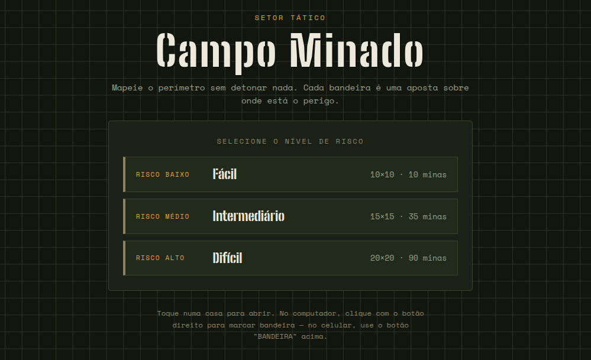
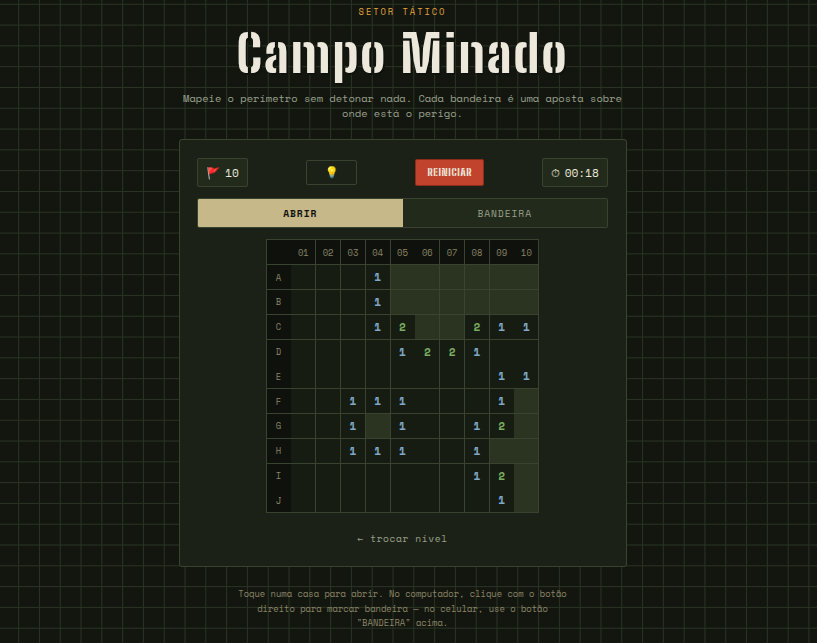
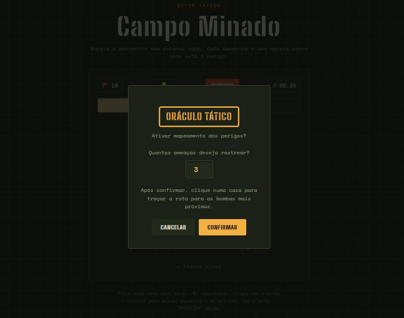
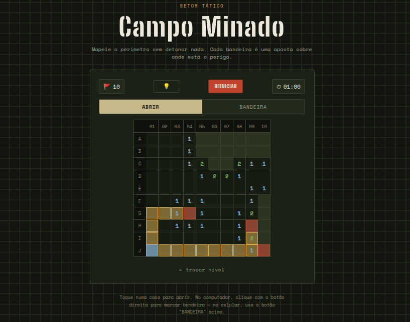

# Campo Minado com Grafos

Conteúdo da Disciplina: Grafos

## 👥 Equipe - Grupo 2

Dupla responsável pela implementação do projeto de Campo Minado utilizando conceitos de grafos.

| Foto | Nome | Matrícula |
|---:|---|---|
|  | **[Giovanna Felipe](https://github.com/giovannafg)** | 241038998 |
|  | **[André Henrique](https://github.com/andrehsb)** | 241025149 |

## Sobre

Projeto de Campo Minado desenvolvido com uma abordagem baseada em grafos, combinando uma interface web em HTML/CSS/JavaScript com um motor de jogo implementado em C. A lógica do tabuleiro representa cada casa como um vértice e as posições vizinhas como arestas, permitindo o cálculo das bombas ao redor e a abertura automática das casas vazias.

## Link do vídeo

- Link para vídeo explicativo: https://youtu.be/u00PP2BrBhw

## Screenshots


<br><br>

<br><br>

<br><br>



## Estruturas de dados e conceitos de grafos implementados

O projeto utiliza uma representação baseada em grafos para modelar o tabuleiro do Campo Minado:

- Cada casa do tabuleiro é tratada como um vértice.
- As casas adjacentes formam arestas, representando os 8 vizinhos possíveis.
- A função de obtenção de arestas do vértice permite identificar os vizinhos de cada célula.
- O contador de bombas ao redor de cada posição utiliza a vizinhança do vértice correspondente.

### Porta 3000

1. Interface web local: http://localhost:3000

## 🚀 Instalação Rápida

```bash
# clonar o repositório
git clone https://github.com/giovannafg/G2_Grafos_EDA2-2026.1

cd G2_Grafos_EDA2-2026.1
```

### Pré-requisitos

- Node.js instalado
- GCC instalado para compilar o motor em C

### Executar localmente

No Windows:

```bat
iniciar-local.bat
```

No Linux/macOS:

```bash
bash iniciar-local.sh
```

Ou diretamente com Node:

```bash
node server.cjs
```

## ▶️ Scripts Úteis

```bash
node server.cjs
bash iniciar-local.sh
iniciar-local.bat
```

## Uso

Ao abrir a aplicação localmente, o usuário pode escolher um nível de dificuldade, abrir casas do tabuleiro e marcar bandeiras em possíveis bombas. O motor em C atualiza o estado do jogo e a interface web exibe se o jogador venceu, perdeu ou continua jogando.

A novidade tática é o botão de Dica: ao ativá-lo, o jogador escolhe quantas ameaças deseja rastrear e clica numa casa do tabuleiro, ativando o algoritmo de busca para desenhar até às bombas mais próximas.

## Estruturas de dados implementadas para otimização

O projeto modela o tabuleiro estritamente como um **Grafo em Grade (Grid Graph)**, onde cada casa é um vértice e suas posições adjacentes formam as arestas. Foram implementados dois algoritmos fundamentais de travessia de grafos para resolver mecânicas específicas do jogo:

* **Busca em Profundidade (DFS):** A escolha da DFS de forma recursiva justifica-se por ser a abordagem mais natural e eficiente em memória para a mecânica de abertura em cascata. Quando o jogador clica em um vértice vazio (com 0 bombas ao redor), o algoritmo explora a **Vizinhança de Moore (8 direções)**, expandindo as fronteiras até encontrar vértices numerados (folhas da recursão), garantindo que grandes blocos do mapa sejam descobertos instantaneamente em tempo linear proporcional à área vazia.
* **Algoritmo de Dijkstra:** Complementarmente, optou-se pelo Algoritmo de Dijkstra para a mecânica do "Oráculo Tático" (Dica), que mapeia a rota até as *X* bombas mais próximas. Num grafo ortogonal, uma Busca em Largura (BFS) tradicional sofreria do fenômeno da "Distância de Manhattan", resultando em rotas redundantes em zigue-zague, pois ela não consegue diferenciar uma reta de um caminho em escada. Transformando o tabuleiro em um Grafo Ponderado com uma *Fila de Prioridade* customizada, estabelecemos uma **Penalidade por Mudança de Direção**: avançar em linha reta custa 10 pontos, enquanto realizar uma curva (alterar a direção em relação ao vértice anterior) soma uma taxa extra de 1 ponto.

Juntos, esses algoritmos asseguram que o sistema mantenha um alto desempenho no processamento de trajetórias e caminhos mínimos, enquanto preserva a integridade visual, eliminando trajetos diagonais confusos através do uso restrito da **Vizinhança de Von Neumann (4 direções)** durante o rastreamento do Oráculo.

### Onde as Buscas são utilizadas:

1.  **Abertura de Casas Seguras (Clique normal):** Utiliza a DFS para revelar recursivamente os espaços não-minados adjacentes.
2.  **Oráculo Tático (Botão da Lâmpada 💡):** Utiliza o Algoritmo de Dijkstra para traçar o rastro de aproximação (em amarelo) a partir da origem clicada (em azul) até as *X* ameaças mais próximas (em vermelho) configuradas pelo utilizador.